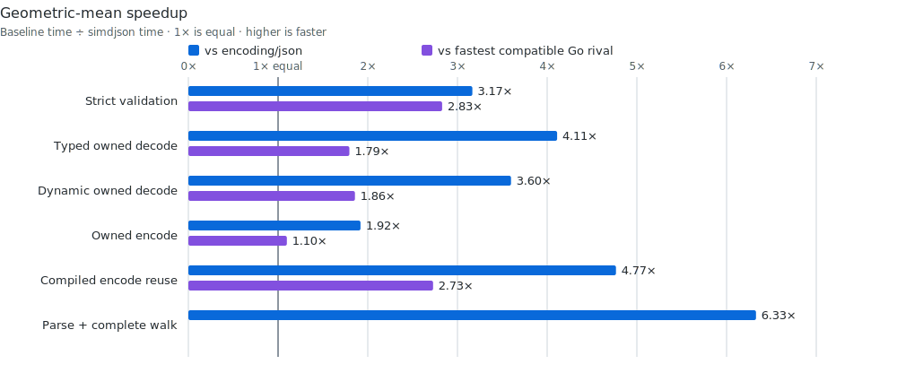

# simdjson

[](https://github.com/thesyncim/simdjson/actions/workflows/ci.yml)

Strict, high-performance JSON for Go, written entirely in Go. The ordinary
`Marshal` and `Unmarshal` APIs follow `encoding/json`; reusable typed plans,
structural indexing, and optional Go-native SIMD accelerate repeated work.
The root module has no third-party module dependencies, assembly, C,
`go:linkname`, or private runtime-layout assumptions.

This project is pre-v1: APIs may change while the accepted
[v1 boundary](docs/adr/0001-v1-api.md) is implemented. It is an independent Go
implementation, not the C++ [`simdjson`](https://github.com/simdjson/simdjson)
project. Algorithm and corpus relationships are recorded in
[the provenance inventory](docs/provenance.md).

## Install

Go 1.26 builds the supported portable backend:

```sh
go get github.com/thesyncim/simdjson@latest
```

The optional SIMD backend requires the exact Go 1.27 development compiler
pinned by the repository:

```sh
./scripts/bootstrap-gotip.sh "$HOME/sdk/simdjson-gotip"
GOEXPERIMENT=simd "$HOME/sdk/simdjson-gotip/bin/go" test ./...
```

`GOEXPERIMENT=simd` selects compiler support, not a CPU. Accelerated binaries
snapshot CPU capabilities during package initialization and retain portable
fallbacks. Go 1.28 and later deliberately use portable source until that
compiler family passes the same correctness, escape, and performance gates.
See the [toolchain policy](docs/toolchain.md).

## Typed decode

```go
package main

import "github.com/thesyncim/simdjson"

type Event struct {
	ID   int      `json:"id"`
	Name string   `json:"name"`
	Tags []string `json:"tags"`
}

func decode(data []byte) (Event, error) {
	var event Event
	err := simdjson.Unmarshal(data, &event)
	return event, err
}
```

## Typed encode

```go
func encode(event *Event) ([]byte, error) {
	encoder, err := simdjson.CompileEncoder[Event](simdjson.EncoderOptions{})
	if err != nil {
		return nil, err
	}
	buf := make([]byte, 0, 4096)
	return encoder.AppendJSON(buf, event)
}
```

`AppendJSON` reuses caller-owned capacity. `Marshal` is the allocating
convenience for occasional calls.

## Choose an API

| Need | Start with |
| --- | --- |
| Ordinary typed JSON or strict validation | `Marshal`, `Unmarshal`, `Valid`, `Validate` |
| Repeated typed work and buffer reuse | `CompileEncoder`, `CompileDecoder` |
| Framed JSON input or token output | `Reader`, `Writer` |
| Compact, indented, or canonical output | `Compact`, `Indent`, `Canonicalize` |
| Borrowed selection or repeated document navigation | `RawValue`, `Index`/`Node`, or `Parse`/`Value` |

The advanced document APIs currently remain in the root package during the
pre-v1 migration. Their target home and compatibility boundary are decided in
the [API ADR](docs/adr/0001-v1-api.md).

## Ownership and concurrency

Default typed decoding and default `Parse` own the string storage they expose.
`ZeroCopy`, `RawValue`, `Index`, `Node`, and reader cursors borrow storage: keep
the source alive and unmodified, and observe each API's invalidation rule.
`Index` and `Node` also borrow caller-provided entry storage.

Compiled encoders, decoders, and pointers are immutable and safe for concurrent
use. Destinations and source buffers remain caller-owned; each `Reader` or
`Writer` belongs to one goroutine. The complete rules are in
[ownership and lifetimes](docs/design/ownership.md).

## Performance

<!-- benchpublish:main-summary:start -->
The current publication is measured from clean library revision
`b05b7ce145bb9a3c53301beb2619241180c786ce`. Measurements use an Apple M4 Max and one CPU. Each row reports the median of
six approximately 300 ms samples; the pinned Go revision is `03845e30f7b73d1703bd8c21017297f6eecb76d6`. Each contract runs in a fresh process so
allocator-heavy dynamic decode cannot perturb later groups. Lower time is
better; speedups are geometric means across the seven exact 6.33 MiB Go
`encoding/json` corpus payloads.

| Operation | Contract | vs stdlib | vs fastest rival | vs native Sonic | SIMD vs pure Go |
|---|---|---:|---:|---:|---:|
| Validate | Strict JSON + UTF-8 | **3.09x** | **2.79x** | **1.37x** | **1.804x** |
| Typed owned decode | Owned strings | **4.17x** | **1.81x** | **1.69x** | **1.124x** |
| Dynamic owned decode | Owned `any` tree | **3.65x** | **1.88x** | **1.14x** | **1.068x** |
| Owned encode | Owned output | **2.55x** | **1.46x** | **2.61x** | **1.318x** |
| Compiled encode reuse | Reused output buffer | **4.63x** | **2.65x** | — | **1.497x** |
| Parse + complete walk | Complete semantic traversal | **6.29x** | — | — | **1.230x** |



The chart shows absolute time to process all seven payloads once. It sums the
per-file medians without converting them to ratios; lower bars are faster. The
table keeps geometric means so small and large payloads receive equal weight
in the aggregate comparison.

The fastest-rival column chooses the best compatible result per payload from
go-json, Segment, jsoniter, and fastjson, all built with the pinned Go tip.
Native Sonic uses its stable supported toolchain in an isolated module; its
syntax-only `Valid` result is context rather than a strict-validation peer.

The same corpus puts `encoding/json/v2` behind by 3.35x on typed decode, 2.03x
on dynamic decode, and 2.39x on owned encode. Reusable structural-index
construction is part of the regular benchmark gate and remains zero-allocation.

[Current per-corpus results, allocations, hook cost, SIMD uplift, charts, and exact commands](benchmarks/README.md).
The [cross-language benchmark](benchmarks/crosslang/README.md) publishes only
the enforced parse-plus-semantic-digest contract as a direct comparison.
<!-- benchpublish:main-summary:end -->

Performance changes must preserve correctness, ownership, retained memory,
`B/op`, and `allocs/op`. Native CI exercises matched portable and SIMD behavior
on amd64 and ARM64. The current accelerated scanner choices are AVX2 on capable
amd64 CPUs and NEON on ARM64; other CPUs use portable Go.

## Support and project records

- [Toolchain and compiler support](docs/toolchain.md)
- [Maintenance baseline](BASELINE.md)
- [Test contract matrix](TEST_CONTRACTS.md)
- [Unsafe inventory](UNSAFE.md)
- [Architecture and ownership records](docs/design/ownership.md)
- [Security policy](SECURITY.md)
- [Contributing and local gates](CONTRIBUTING.md)

The repository does not yet have a root project license. `LICENSE-GO` covers
identified Go-derived files only. Selecting a project license and completing
the final notice and attribution audit remain release blockers; no license is
implied by this README.
