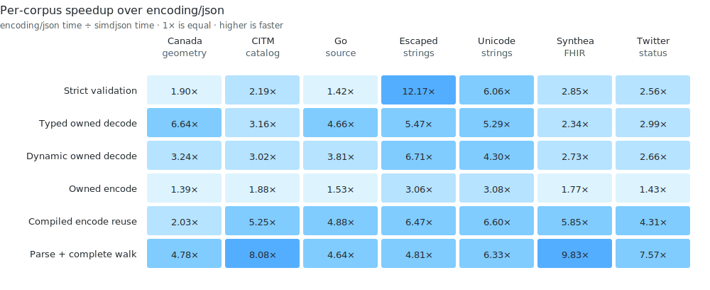

# simdjson benchmarks

This separate module measures the repository's release contract: strict
correctness, safe default ownership, fast ordinary paths, and zero hidden
tuning requirements. Comparison-only dependencies never enter the root module
graph.

## Publication record

<!-- benchpublish:go-publication:start -->
Every table in this document is generated from one clean publication record:

| Component | Revision |
|---|---|
| simdjson | `ed273875f67d8f06b03286bedfee43f778d6a8df` (`dirty=false`) |
| Go | `go1.27-devel_03845e30 Fri Jul 10 12:31:49 2026 -0700 darwin/arm64`, commit `03845e30f7b73d1703bd8c21017297f6eecb76d6` |
| Machine | Apple M4 Max, `darwin/arm64`, one CPU |
| Samples | six approximately 300 ms samples, median reported |

Each `valid`, `dynamic-owned`, `dom`, `typed-reused`, and `encode`
contract runs in a fresh process. Compilation, plan creation, fixture decode,
capacity preparation, and correctness checks happen before the timer.

## Headline geomeans

| Operation | vs `encoding/json` | vs fastest compatible rival | SIMD vs pure Go |
|---|---:|---:|---:|
| Strict validation | **3.166x** | **2.829x** | **1.803x** |
| Typed owned decode | **4.111x** | **1.795x** | **1.092x** |
| Dynamic owned decode | **3.597x** | **1.857x** | **1.063x** |
| Owned encode | **1.919x** | **1.098x** | **1.257x** |
| Compiled encode reuse | **4.767x** | **2.728x** | **1.496x** |
| Parse + complete walk | **6.328x** | — | **1.222x** |


Read each bar as baseline time divided by simdjson time. The `1x` line is
equal performance; longer bars are faster.

The rival is the fastest compatible per-payload result from go-json, Segment,
jsoniter, or fastjson. Aggregate leads do not imply a win on every payload.

## Per-corpus results

### Strict validation

| Corpus | `encoding/json` | simdjson | Rival | Rival time | vs stdlib | vs rival |
|---|---:|---:|---|---:|---:|---:|
| Canada geometry | 227.1 us | **119.4 us** | fastjson | 214.5 us | **1.90x** | **1.80x** |
| CITM catalog | 761.1 us | **347.6 us** | fastjson | 850.7 us | **2.19x** | **2.45x** |
| Go source | 1.329 ms | **932.7 us** | Segment | 1.189 ms | **1.42x** | **1.28x** |
| Escaped strings | 53.8 us | **4.4 us** | Segment | 55.6 us | **12.17x** | **12.59x** |
| Unicode strings | 19.9 us | **3.3 us** | fastjson | 7.2 us | **6.06x** | **2.19x** |
| Synthea FHIR | 1.041 ms | **365.5 us** | fastjson | 1.268 ms | **2.85x** | **3.47x** |
| Twitter status | 372.1 us | **145.3 us** | fastjson | 393.0 us | **2.56x** | **2.70x** |

Valid input allocates zero bytes and zero objects.

### Typed owned decode

| Corpus | `encoding/json` | simdjson | Rival | Rival time | vs stdlib | vs rival |
|---|---:|---:|---|---:|---:|---:|
| Canada geometry | 1.270 ms | **191.4 us** | Segment | 790.1 us | **6.64x** | **4.13x** |
| CITM catalog | 2.580 ms | **816.0 us** | go-json | 1.296 ms | **3.16x** | **1.59x** |
| Go source | 6.327 ms | **1.357 ms** | Segment | 2.240 ms | **4.66x** | **1.65x** |
| Escaped strings | 200.8 us | **36.7 us** | go-json | 68.1 us | **5.47x** | **1.85x** |
| Unicode strings | 44.5 us | **8.4 us** | go-json | 13.9 us | **5.29x** | **1.66x** |
| Synthea FHIR | 3.970 ms | **1.696 ms** | go-json | 2.027 ms | **2.34x** | **1.19x** |
| Twitter status | 1.403 ms | **469.0 us** | go-json | 709.0 us | **2.99x** | **1.51x** |

### Dynamic owned decode

| Corpus | `encoding/json` | simdjson | Rival | Rival time | vs stdlib | vs rival |
|---|---:|---:|---|---:|---:|---:|
| Canada geometry | 3.004 ms | **926.8 us** | go-json | 1.891 ms | **3.24x** | **2.04x** |
| CITM catalog | 7.652 ms | **2.537 ms** | jsoniter | 4.488 ms | **3.02x** | **1.77x** |
| Go source | 17.809 ms | **4.678 ms** | jsoniter | 9.744 ms | **3.81x** | **2.08x** |
| Escaped strings | 216.6 us | **32.3 us** | go-json | 76.4 us | **6.71x** | **2.36x** |
| Unicode strings | 55.8 us | **13.0 us** | go-json | 21.1 us | **4.30x** | **1.63x** |
| Synthea FHIR | 11.485 ms | **4.203 ms** | jsoniter | 6.952 ms | **2.73x** | **1.65x** |
| Twitter status | 3.514 ms | **1.323 ms** | go-json | 2.107 ms | **2.66x** | **1.59x** |

Dynamic `any` values use ordinary Go interface construction. The current
allocation profile is:

| Corpus | Bytes/op | Allocs/op |
|---|---:|---:|
| Canada geometry | 1,440,704 | 22,228 |
| CITM catalog | 6,193,280 | 41,187 |
| Go source | 7,611,600 | 103,805 |
| Escaped strings | 41,112 | 77 |
| Unicode strings | 34,968 | 76 |
| Synthea FHIR | 8,630,136 | 64,558 |
| Twitter status | 2,404,688 | 11,209 |

### Encode

| Corpus | stdlib | Owned | Compiled reuse | Rival | Rival time |
|---|---:|---:|---:|---|---:|
| Canada geometry | 649.8 us | **466.4 us** | **320.5 us** | Segment | 538.9 us |
| CITM catalog | 1.091 ms | 579.9 us | **207.6 us** | Segment | **404.4 us** |
| Go source | 3.361 ms | 2.199 ms | **689.4 us** | Segment | **1.391 ms** |
| Escaped strings | 22.4 us | **7.3 us** | **3.5 us** | jsoniter | 23.1 us |
| Unicode strings | 22.7 us | **7.4 us** | **3.4 us** | jsoniter | 22.6 us |
| Synthea FHIR | 6.118 ms | 3.458 ms | **1.047 ms** | Segment | **2.007 ms** |
| Twitter status | 756.4 us | 527.8 us | **175.4 us** | go-json | **355.4 us** |

### Parse and complete walk

| Corpus | stdlib `any` + walk | simdjson parse + walk | Lead |
|---|---:|---:|---:|
| Canada geometry | 2.964 ms | **619.7 us** | **4.78x** |
| CITM catalog | 8.382 ms | **1.037 ms** | **8.08x** |
| Go source | 19.125 ms | **4.119 ms** | **4.64x** |
| Escaped strings | 214.0 us | **44.5 us** | **4.81x** |
| Unicode strings | 54.6 us | **8.6 us** | **6.33x** |
| Synthea FHIR | 12.625 ms | **1.284 ms** | **9.83x** |
| Twitter status | 3.715 ms | **491.0 us** | **7.57x** |



Each cell is `encoding/json` time divided by simdjson time for that exact
operation and payload. `1x` is equal performance; larger values are faster.

### Reusable structural index

`BuildIndex` validates the input and builds a caller-owned navigable tape.
Correctly sized storage is reused; every row allocates zero bytes and objects.

| Corpus | Time | Throughput |
|---|---:|---:|
| Canada geometry | **126.8 us** | **2.13 GB/s** |
| CITM catalog | **405.5 us** | **4.26 GB/s** |
| Go source | **885.3 us** | **2.19 GB/s** |
| Escaped strings | **4.8 us** | **8.84 GB/s** |
| Unicode strings | **3.5 us** | **5.14 GB/s** |
| Synthea FHIR | **438.0 us** | **4.59 GB/s** |
| Twitter status | **159.1 us** | **3.97 GB/s** |

## Native hook cost

Hooks keep the public API composable without weakening default ownership.
Decode uses retainable receiver state; encode passes ordinary GC-visible
receivers.

| Case | Interpreter | Native hook | Hook / interpreter | Bytes/op | Allocs/op |
|---|---:|---:|---:|---:|---:|
| Decode small | 45.7 ns | 133.9 ns | 2.93x | 144 | 2 |
| Decode 1,024 records | 77.1 us | 166.8 us | 2.16x | 147,456 | 2,048 |
| Encode small | 37.2 ns | 32.9 ns | 0.88x | 0 | 0 |
| Encode 1,024 records | 41.1 us | 39.4 us | 0.96x | 13 | 0 |

## SIMD controls

Both binaries use the same candidate, compiler, corpus, isolated-process
contract, and one CPU.

| Path | SIMD wins | Geomean uplift |
|---|---:|---:|
| Validation | 6/7 | **1.803x** |
| Dynamic owned | 4/7 | **1.063x** |
| Dynamic zero-copy | 4/7 | **1.080x** |
| Parse + complete walk | 6/7 | **1.222x** |
| Typed owned | 4/7 | **1.092x** |
| Typed zero-copy | 3/7 | **1.130x** |
| Encode owned | 5/7 | **1.257x** |
| Encode compiled reuse | 5/7 | **1.496x** |
| Reusable structural index | 6/7 | **1.745x** |


Each bar is portable-Go time divided by SIMD time. `1x` is equal
performance; values above `1x` are a SIMD win.

## Additional Go context

`encoding/json/v2` is built from the pinned Go tip. Its time divided by
simdjson time is 3.293x for typed owned decode, 1.987x for dynamic owned decode,
and 1.748x for owned encode.

Sonic is measured with `go1.26.4 darwin/arm64` because its native path does not support
the pinned Go tip. Sonic time divided by simdjson time is 1.657x for typed
owned decode, 1.119x for dynamic owned decode, and 1.963x for owned encode. Its
syntax-only validation result (1.364x) is context, not a strict-UTF-8 peer.
<!-- benchpublish:go-publication:end -->

## Reproduce

Build the pinned toolchain and run the default publication path:

```sh
./scripts/bootstrap-gotip.sh "$HOME/sdk/simdjson-gotip"
TIP_GO="$HOME/sdk/simdjson-gotip/bin/go" ./benchmarks/publish.sh
```

The publisher refuses a dirty tree, records the repository and toolchain
revisions, uses six 300 ms one-CPU samples, starts every corpus contract in a
fresh process, runs pure-Go, jsonv2, native Sonic, hook, and C++ controls,
verifies cross-language digests, and generates every table and chart from the
same normalized result file. Use `run-comparison.sh` directly for exploratory
`BENCH`, `BENCHTIME`, and `COUNT` overrides.

The equivalent C++ command and current results are documented under
[crosslang](crosslang/). That runner fails unless every semantic digest matches
and the repository is clean.

The interleaved before/after gate used for hot-path changes is:

```sh
GOTIP="$HOME/sdk/simdjson-gotip/bin/go" ./scripts/bench-gate.sh -b HEAD~1
```

Its default pattern covers validation, reusable structural indexing, typed and
dynamic decode, and encode. It exits non-zero for any statistically significant
`sec/op` regression above 2% and for any significant `B/op` or `allocs/op`
increase; `-r` changes the time threshold and `-d .` selects root-package
resource and hook contracts. Pull requests run these checks on the dedicated
`simdjson-performance` runner rather than a noisy shared host. The nested
module pins every comparison dependency in `go.mod` and `go.sum`.
