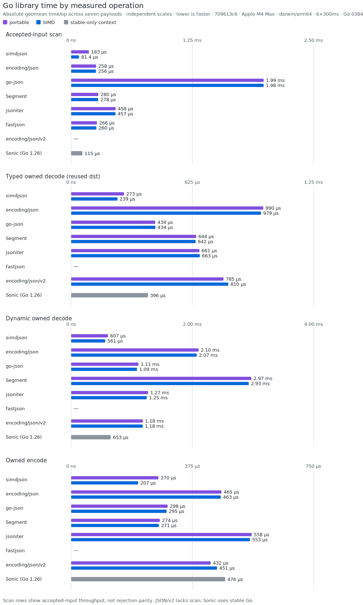
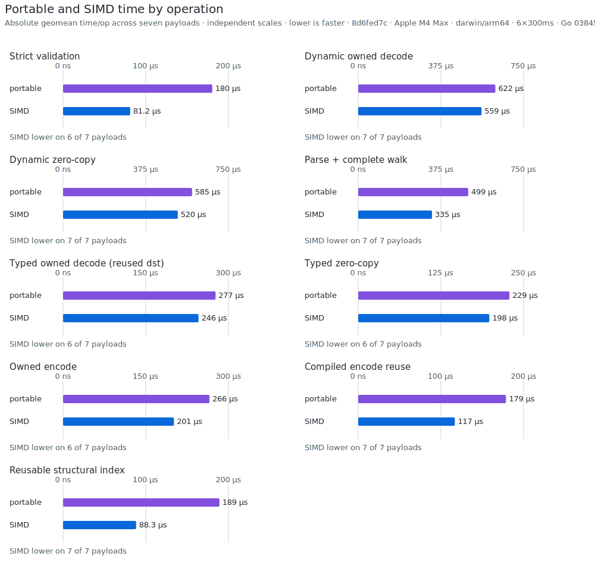
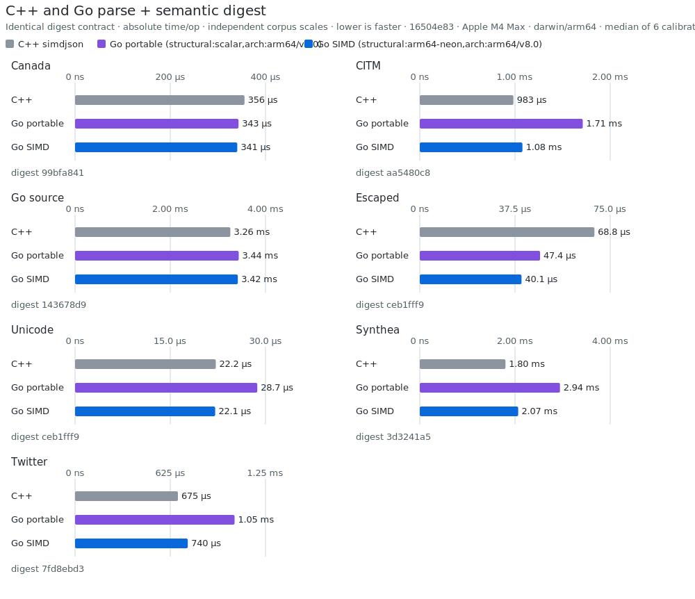

# simdjson benchmarks

This separate module measures correctness-equivalent operations without adding
comparison dependencies to the root module. The committed publication is one
machine-specific record, not a universal ranking.

## Publication record

[`results/latest.json`](results/latest.json) is the publication source of truth.
It records the clean repository revision, compiler revisions, architecture,
sample contract, every raw Go benchmark sample, cross-language digests, and
cross-language timings. Three checked-in SVGs are deterministic views of that
record; the publisher regenerates and verifies them without generating README
tables.

## Generated snapshot charts



Each operation panel plots absolute geometric-mean time per operation across
the seven payloads. Portable and SIMD modes are separate bars; every panel has
its own zero-based time scale and lower is faster. Missing rows are intentional:
JSON/v2 has no `Valid` entry, fastjson does not implement the owned contracts,
and Sonic is isolated on its supported stable compiler. Valid-input throughput
alone is not proof of equivalent malformed-input rejection.



The portable/SIMD panels use matched compiler, corpus, ownership, and reuse
contracts. They show both absolute geometric-mean times directly, with an
independent zero-based scale per operation and the number of payloads where the
SIMD time was lower.

Cleanup deltas use the immutable
[`d779a816` maintenance baseline](../docs/maintenance-baseline.json). That
record fixes API, source, test, unsafe, fuzz, build-size, and starting
performance measurements; it is not a moving current-results file.

The Go comparison runs these operations in separate processes under explicit
`GOEXPERIMENT=nosimd` and `GOEXPERIMENT=simd` modes:

- simdjson strict JSON and UTF-8 validation, with accepted-input throughput
  context for peer validators;
- typed owned decode into reused destinations and dynamic owned decode;
- parse plus complete semantic traversal;
- owned encode and compiled encoder reuse;
- reusable structural-index construction;
- native hook controls; and
- matched portable-Go and SIMD binaries.

Preparation, fixture decoding, plan construction, capacity discovery, and
correctness checks stay outside timed regions. Timed rows use one logical CPU
and report `ns/op`, `B/op`, and `allocs/op`. Comparison rows are meaningful only
when ownership and semantic contracts match.

The cross-language control enforces the same parse-plus-semantic-digest
operation in C++ simdjson, portable Go, and SIMD Go, and rejects any digest
mismatch.



This is an end-to-end parse, traversal, scalar-decode, and digest contract—not
a parser-only ranking. A stable-toolchain-only native
competitor is kept in the isolated [`legacy`](legacy/) module because it does
not support the pinned development compiler; those rows are never treated as
same-toolchain results, and its syntax-only validation is not a strict UTF-8
peer.

### Cross-language contract

Every timed C++ and Go iteration parses the already-loaded source, visits every
array element and object member in source order, decodes every key and string,
classifies each number into the same signed, unsigned, binary64, or big-integer
category, and hashes the complete semantic event stream with 64-bit FNV-1a.

File I/O, capacity discovery, reusable storage allocation, and reference-digest
construction remain outside the timer. Grammar validation, unescaping, number
conversion, traversal, and digest construction are inside it. The runner
compares every digest before publishing results.

The C++ control pins simdjson 4.6.4 at commit
`1bcf71bd85059ab6574ea1159de9298dcc1212c5`; that revision and the active C++
backend are stored in the publication record. Optional Rust diagnostics remain
pinned by their lockfile but are not part of the published comparison. Reproduce
the direct control with:

```sh
TIP_GO="$HOME/sdk/simdjson-gotip/bin/go" ./benchmarks/crosslang/run.sh
```

The direct runner requires `clang++`, `cargo`, `zstd`, and git. Publication uses
the contract-only path, which does not require Cargo. Both refuse a dirty
repository by default.

## Mutable Store and DuckDB

[`duckdbbench/duckdb-methodology.md`](duckdbbench/duckdb-methodology.md)
defines the embedded JSON-store comparison. It generates one shared NDJSON
corpus, measures keyed Store operations, runs the pinned official DuckDB image,
retains DuckDB's raw JSON profiles, verifies both engines against generator
truth, and renders Store heap/external blocks, DuckDB warm/peak buffers, and
durable file bytes without mixing their accounting domains. The frozen 10K
clustered smoke is
[`results/duckdb-synth-s4.md`](results/duckdb-synth-s4.md); the methodology also
provides identical 100K and 5M commands.

Ordinary tests validate generation, parsing, accounting, and the Store side.
The container smoke is explicit:

```sh
cd benchmarks
DUCKDBBENCH=1 go test ./duckdbbench -run TestPinnedDuckDBEndToEnd -count=1
```

## Publish a record

Build the pinned compiler, then run the clean-tree publication path:

```sh
./scripts/bootstrap-gotip.sh "$HOME/sdk/simdjson-gotip"
TIP_GO="$HOME/sdk/simdjson-gotip/bin/go" ./benchmarks/publish.sh
```

The Go runner uses six 300 ms samples by default. The C++/Go control reports the
median of six calibrated samples that each run for at least 250 ms. `BENCHTIME`
and `COUNT` may be overridden for exploratory Go runs; do not commit such a
record as release evidence. `internal/cmd/benchpublish` refuses incomplete
operations, duplicate or unmatched mode rows, invalid samples, dirty metadata,
stale charts, backend mismatches, or cross-language digest mismatches.

## Performance gate

Hot-path changes must pass the interleaved before/after gate with both supported
compiler modes:

```sh
BENCH_GO="$(command -v go)" BENCH_GOEXPERIMENT= \
  ./scripts/bench-gate.sh -b HEAD~1 -c 63
BENCH_GO="$HOME/sdk/simdjson-gotip/bin/go" BENCH_GOEXPERIMENT=simd \
  ./scripts/bench-gate.sh -b HEAD~1 -c 63
```

The default selector covers validation, structural indexing, typed and dynamic
decode, and encode. The gate rejects statistically significant `sec/op`
regressions above 2% and any significant `B/op` or `allocs/op` increase. A
targeted gate must set the exact row count with `-c`; resource and hook contracts
use `-d .` with their explicit selectors. The manual performance workflow runs
the hard gates on a dedicated ARM64 runner; hosted ARM64 and amd64 jobs provide
directional comparisons only.
