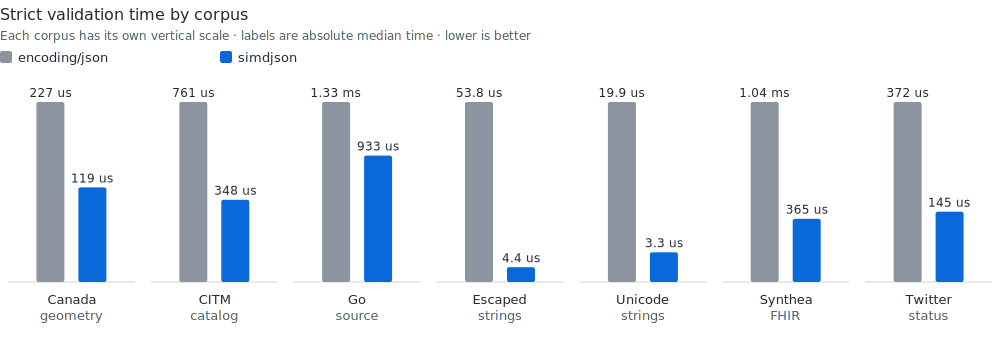
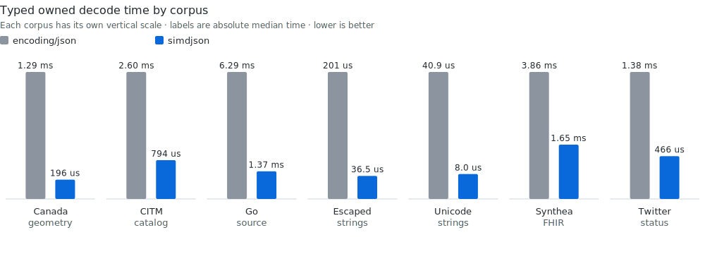
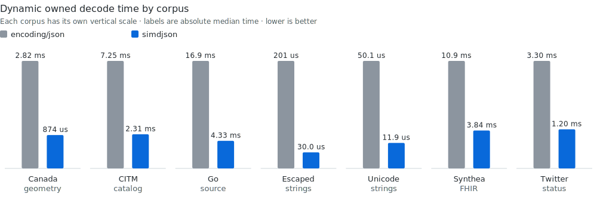
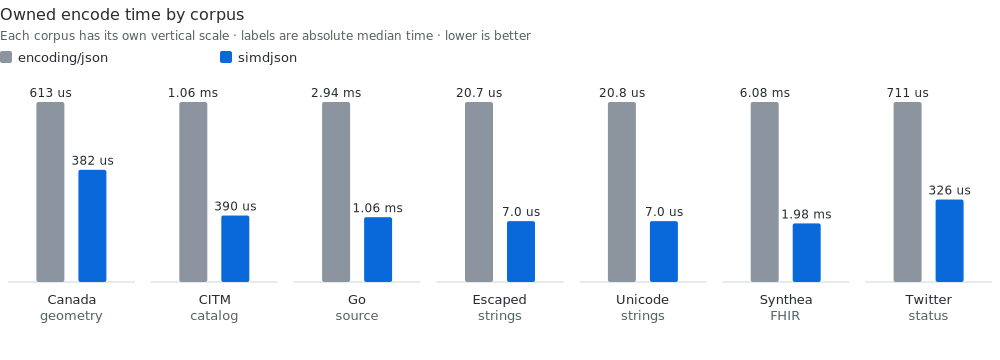
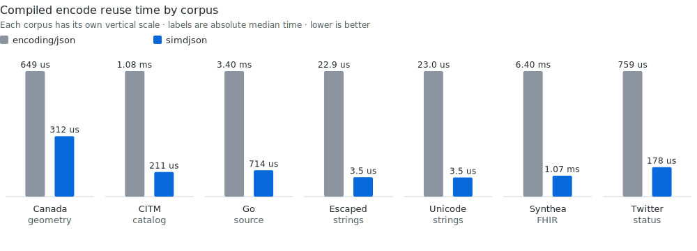
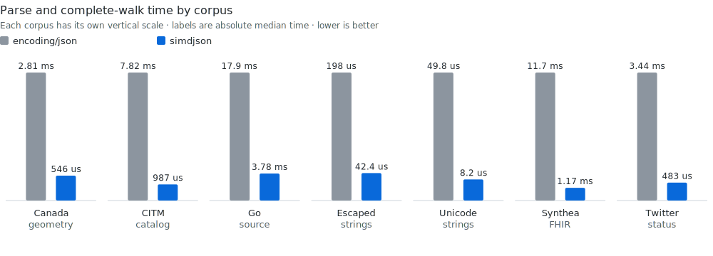
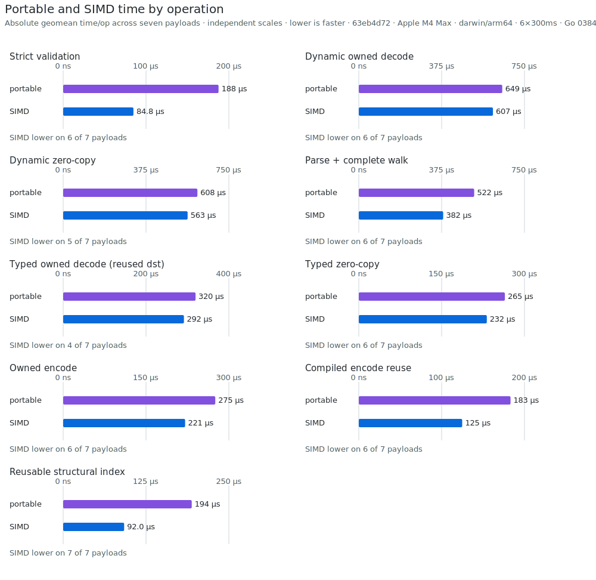

# simdjson benchmarks

This separate module measures the repository's release contract: strict
correctness, safe default ownership, fast ordinary paths, and zero hidden
tuning requirements. Comparison-only dependencies never enter the root module
graph.

## Publication record

<!-- benchpublish:go-publication:start -->
Every table in this document is generated from one clean publication record:

| Component | Revision |
|---|---|
| simdjson | `c1f941b8b14a62a1955bf91dedd1c1dcad1dd420` (`dirty=false`) |
| Go | `go1.27-devel_03845e30 Fri Jul 10 12:31:49 2026 -0700 darwin/arm64`, commit `03845e30f7b73d1703bd8c21017297f6eecb76d6` |
| Machine | Apple M4 Max, `darwin/arm64`, one CPU |
| Samples | six approximately 300 ms samples, median reported |

Each `valid`, `dynamic-owned`, `dom`, `typed-reused`, and `encode`
contract runs in a fresh process. Compilation, plan creation, fixture decode,
capacity preparation, and correctness checks happen before the timer.

## Headline geomeans

| Operation | vs `encoding/json` | vs fastest compatible rival | SIMD vs pure Go |
|---|---:|---:|---:|
| Strict validation | **3.090x** | **2.854x** | **1.785x** |
| Typed owned decode | **4.093x** | **1.815x** | **1.131x** |
| Dynamic owned decode | **3.581x** | **1.861x** | **1.076x** |
| Owned encode | **2.488x** | **1.455x** | **1.264x** |
| Compiled encode reuse | **4.753x** | **2.779x** | **1.477x** |
| Parse + complete walk | **6.320x** | — | **1.306x** |


The chart sums the seven per-file median times and shows the absolute time to
complete one full corpus pass; lower bars are faster. The table uses
geometric-mean ratios so every payload has equal aggregate weight.

The rival is the fastest compatible per-payload result from go-json, Segment,
jsoniter, or fastjson. Aggregate leads do not imply a win on every payload.

## Per-corpus results

### Strict validation

| Corpus | `encoding/json` | simdjson | Rival | Rival time | vs stdlib | vs rival |
|---|---:|---:|---|---:|---:|---:|
| Canada geometry | 226.2 us | **122.9 us** | fastjson | 223.6 us | **1.84x** | **1.82x** |
| CITM catalog | 771.7 us | **362.7 us** | fastjson | 877.0 us | **2.13x** | **2.42x** |
| Go source | 1.354 ms | **972.7 us** | Segment | 1.243 ms | **1.39x** | **1.28x** |
| Escaped strings | 56.4 us | **4.5 us** | Segment | 57.8 us | **12.57x** | **12.87x** |
| Unicode strings | 18.8 us | **3.4 us** | fastjson | 7.3 us | **5.58x** | **2.17x** |
| Synthea FHIR | 1.045 ms | **367.0 us** | fastjson | 1.324 ms | **2.85x** | **3.61x** |
| Twitter status | 365.7 us | **148.1 us** | fastjson | 401.9 us | **2.47x** | **2.71x** |



Each vertical pair is one measured payload with its own scale; the labels are
absolute median times and lower bars are faster. Valid input allocates zero
bytes and zero objects.

### Typed owned decode

| Corpus | `encoding/json` | simdjson | Rival | Rival time | vs stdlib | vs rival |
|---|---:|---:|---|---:|---:|---:|
| Canada geometry | 1.286 ms | **195.6 us** | Segment | 798.1 us | **6.57x** | **4.08x** |
| CITM catalog | 2.601 ms | **794.4 us** | go-json | 1.289 ms | **3.27x** | **1.62x** |
| Go source | 6.290 ms | **1.369 ms** | Segment | 2.262 ms | **4.59x** | **1.65x** |
| Escaped strings | 201.1 us | **36.5 us** | go-json | 68.1 us | **5.51x** | **1.87x** |
| Unicode strings | 40.9 us | **8.0 us** | go-json | 13.7 us | **5.10x** | **1.70x** |
| Synthea FHIR | 3.863 ms | **1.654 ms** | go-json | 2.048 ms | **2.34x** | **1.24x** |
| Twitter status | 1.383 ms | **466.3 us** | go-json | 702.1 us | **2.97x** | **1.51x** |



Each corpus keeps its measured time rather than converting the bars to a
ratio.

### Dynamic owned decode

| Corpus | `encoding/json` | simdjson | Rival | Rival time | vs stdlib | vs rival |
|---|---:|---:|---|---:|---:|---:|
| Canada geometry | 3.063 ms | **939.7 us** | go-json | 1.920 ms | **3.26x** | **2.04x** |
| CITM catalog | 7.847 ms | **2.563 ms** | jsoniter | 4.589 ms | **3.06x** | **1.79x** |
| Go source | 18.038 ms | **4.834 ms** | go-json | 9.989 ms | **3.73x** | **2.07x** |
| Escaped strings | 223.5 us | **33.5 us** | go-json | 79.1 us | **6.68x** | **2.36x** |
| Unicode strings | 55.1 us | **13.4 us** | go-json | 21.9 us | **4.12x** | **1.64x** |
| Synthea FHIR | 11.814 ms | **4.291 ms** | jsoniter | 7.104 ms | **2.75x** | **1.66x** |
| Twitter status | 3.547 ms | **1.325 ms** | go-json | 2.116 ms | **2.68x** | **1.60x** |



Each corpus keeps its measured time rather than converting the bars to a
ratio.

Dynamic `any` values use ordinary Go interface construction. The current
allocation profile is:

| Corpus | Bytes/op | Allocs/op |
|---|---:|---:|
| Canada geometry | 1,440,704 | 22,228 |
| CITM catalog | 6,193,280 | 41,187 |
| Go source | 7,611,600 | 103,805 |
| Escaped strings | 41,112 | 77 |
| Unicode strings | 34,968 | 76 |
| Synthea FHIR | 8,630,136 | 64,558 |
| Twitter status | 2,404,688 | 11,209 |

### Encode

| Corpus | stdlib | Owned | Compiled reuse | Rival | Rival time |
|---|---:|---:|---:|---|---:|
| Canada geometry | 648.6 us | **398.6 us** | **312.3 us** | Segment | 530.5 us |
| CITM catalog | 1.076 ms | 427.8 us | **211.2 us** | go-json | **405.9 us** |
| Go source | 3.398 ms | **1.368 ms** | **713.9 us** | Segment | 1.433 ms |
| Escaped strings | 22.9 us | **7.7 us** | **3.5 us** | Segment | 24.8 us |
| Unicode strings | 23.0 us | **7.5 us** | **3.5 us** | Segment | 24.4 us |
| Synthea FHIR | 6.403 ms | 2.181 ms | **1.067 ms** | Segment | **2.067 ms** |
| Twitter status | 759.1 us | **349.5 us** | **177.8 us** | go-json | 365.3 us |





The two charts separate owned output from caller-buffer reuse. Every corpus
has its own vertical scale and retains the absolute median labels.


### Parse and complete walk

| Corpus | stdlib `any` + walk | simdjson parse + walk | Lead |
|---|---:|---:|---:|
| Canada geometry | 2.983 ms | **596.2 us** | **5.00x** |
| CITM catalog | 8.414 ms | **1.041 ms** | **8.08x** |
| Go source | 19.471 ms | **4.095 ms** | **4.75x** |
| Escaped strings | 211.9 us | **45.7 us** | **4.63x** |
| Unicode strings | 51.1 us | **8.7 us** | **5.87x** |
| Synthea FHIR | 12.657 ms | **1.270 ms** | **9.96x** |
| Twitter status | 3.822 ms | **494.6 us** | **7.73x** |



Every vertical pair shows the absolute time to complete the same
parse-and-walk task; lower bars are faster.

### Reusable structural index

`BuildIndex` validates the input and builds a caller-owned navigable tape.
Correctly sized storage is reused; every row allocates zero bytes and objects.

| Corpus | Time | Throughput |
|---|---:|---:|
| Canada geometry | **124.9 us** | **2.17 GB/s** |
| CITM catalog | **406.4 us** | **4.25 GB/s** |
| Go source | **880.1 us** | **2.20 GB/s** |
| Escaped strings | **4.8 us** | **8.73 GB/s** |
| Unicode strings | **3.5 us** | **5.12 GB/s** |
| Synthea FHIR | **438.7 us** | **4.58 GB/s** |
| Twitter status | **157.5 us** | **4.01 GB/s** |

## Native hook cost

Hooks keep the public API composable without weakening default ownership.
Decode uses retainable receiver state; encode passes ordinary GC-visible
receivers.

| Case | Interpreter | Native hook | Hook / interpreter | Bytes/op | Allocs/op |
|---|---:|---:|---:|---:|---:|
| Decode small | 47.3 ns | 136.4 ns | 2.88x | 144 | 2 |
| Decode 1,024 records | 76.6 us | 168.3 us | 2.20x | 147,456 | 2,048 |
| Encode small | 37.7 ns | 33.5 ns | 0.89x | 0 | 0 |
| Encode 1,024 records | 41.8 us | 40.4 us | 0.97x | 13 | 0 |

## SIMD controls

Both binaries use the same candidate, compiler, corpus, isolated-process
contract, and one CPU.

| Path | SIMD wins | Geomean uplift |
|---|---:|---:|
| Validation | 6/7 | **1.785x** |
| Dynamic owned | 5/7 | **1.076x** |
| Dynamic zero-copy | 4/7 | **1.081x** |
| Parse + complete walk | 6/7 | **1.306x** |
| Typed owned | 6/7 | **1.131x** |
| Typed zero-copy | 6/7 | **1.168x** |
| Encode owned | 6/7 | **1.264x** |
| Encode compiled reuse | 6/7 | **1.477x** |
| Reusable structural index | 6/7 | **1.734x** |



Each pair is the absolute time for one pass over all seven payloads. Pairs use
independent vertical scales so small paths remain legible; labels preserve the
measured time and lower bars are faster.

## Additional Go context

`encoding/json/v2` is built from the pinned Go tip. Its time divided by
simdjson time is 3.327x for typed owned decode, 1.977x for dynamic owned decode,
and 2.297x for owned encode.

Sonic is measured with `go1.26.4 darwin/arm64`. Its native path does not support the pinned Go
tip. Sonic time divided by simdjson time is 1.686x for typed owned decode,
1.150x for dynamic owned decode, and 2.536x for owned encode. Its syntax-only
validation result (1.373x) is context, not a strict-UTF-8 peer.
<!-- benchpublish:go-publication:end -->

## Reproduce

Build the pinned toolchain and run the default publication path:

```sh
./scripts/bootstrap-gotip.sh "$HOME/sdk/simdjson-gotip"
TIP_GO="$HOME/sdk/simdjson-gotip/bin/go" ./benchmarks/publish.sh
```

The publisher refuses a dirty tree, records the repository and toolchain
revisions, uses six 300 ms one-CPU samples, starts every corpus contract in a
fresh process, runs pure-Go, jsonv2, native Sonic, hook, and C++ controls,
verifies cross-language digests, and generates every table and chart from the
same normalized result file. Use `run-comparison.sh` directly for exploratory
`BENCH`, `BENCHTIME`, and `COUNT` overrides.

The equivalent C++ command and current results are documented under
[crosslang](crosslang/). That runner fails unless every semantic digest matches
and the repository is clean.

The interleaved before/after gate used for hot-path changes is:

```sh
GOTIP="$HOME/sdk/simdjson-gotip/bin/go" ./scripts/bench-gate.sh -b HEAD~1
```

Its default pattern covers validation, reusable structural indexing, typed and
dynamic decode, and encode. It exits non-zero for any statistically significant
`sec/op` regression above 2% and for any significant `B/op` or `allocs/op`
increase; `-r` changes the time threshold and `-d .` selects root-package
resource and hook contracts. Pull requests run these checks on the dedicated
`simdjson-performance` runner rather than a noisy shared host. The nested
module pins every comparison dependency in `go.mod` and `go.sum`.
