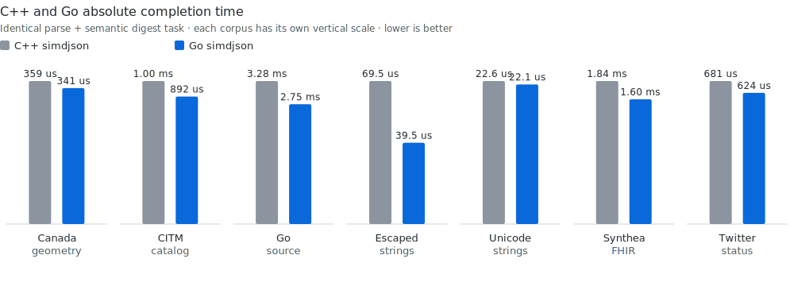

# Equivalent C++/Go corpus benchmark

This directory provides one direct cross-language comparison:
`parse+semantic-digest`. It uses the same seven-payload corpus, machine, source
bytes, traversal order, number categories, decoded strings, and digest in both
implementations.

Representation-specific DOM, typed decode, validation-only, and serialization
measurements do different work and are intentionally not ranked here.

## Enforced contract

Every timed iteration:

1. parses the complete, already-loaded source with reusable parser storage;
2. visits every array element and object member in source order;
3. decodes every object key and string value;
4. decodes every number to the same signed, unsigned, binary64, or big-integer
   category; and
5. hashes the complete semantic event stream with the same 64-bit FNV-1a
   algorithm.

File I/O, capacity discovery, reusable storage allocation, and the reference
digest are outside the timer. Grammar validation, unescaping, number
conversion, complete traversal, and digest construction are inside it.

The runner compares every C++ and Go digest and exits with an error before
publication if any pair differs. It also refuses a dirty repository by default,
and pins C++ simdjson 4.6.4 at git commit
`1bcf71bd85059ab6574ea1159de9298dcc1212c5`.

## Current release-candidate result

<!-- benchpublish:cross-language:start -->
| Component | Revision |
|---|---|
| Go simdjson | `ed273875f67d8f06b03286bedfee43f778d6a8df` (`dirty=false`) |
| Go compiler | `go1.27-devel_03845e30 Fri Jul 10 12:31:49 2026 -0700 darwin/arm64`, `GOEXPERIMENT=simd` |
| C++ simdjson | simdjson 4.6.4, commit `1bcf71bd85059ab6574ea1159de9298dcc1212c5`, arm64 implementation |
| C++ compiler | Apple clang version 21.0.0 (clang-2100.1.1.101) |
| Machine | Apple M4 Max, single thread |

Six approximately 300 ms samples are taken per operation; the median is reported.

| Corpus | Digest | C++ | Go | Go speedup |
|---|---|---:|---:|---:|
| Canada geometry | `99bfa84117bedba4` | 358.803 us | **341.102 us** | **1.052x** |
| CITM catalog | `aa5480c889a90335` | 1.000670 ms | **892.307 us** | **1.121x** |
| Go source | `143678d948841678` | 3.281954 ms | **2.749569 ms** | **1.194x** |
| Escaped strings | `ceb1fff950644c35` | 69.538 us | **39.530 us** | **1.759x** |
| Unicode strings | `ceb1fff950644c35` | 22.636 us | **22.096 us** | **1.024x** |
| Synthea FHIR | `3d3241a500faabe1` | 1.838083 ms | **1.603395 ms** | **1.146x** |
| Twitter status | `7fd8ebd3db991240` | 680.820 us | **624.488 us** | **1.090x** |



The chart uses absolute median time and lower bars are faster; each corpus has
its own vertical scale so small inputs stay visible. `Go speedup` in the table
is C++ time divided by Go time. Values above `1x` mean Go is faster, and the
raw medians remain in the adjacent columns. The identical digest for the two
string fixtures is expected: they decode to the same semantic value even
though one source uses escapes and the other uses literal Unicode.
<!-- benchpublish:cross-language:end -->

## Reproduce

The runner requires `clang++`, `cargo`, `zstd`, git, and the pinned Go
binary:

```sh
TIP_GO="$HOME/sdk/gotip/bin/go" ./benchmarks/crosslang/run.sh
```

It prints the exact repository commit, dirty status, toolchains, implementation
selection, per-row digests, and timings. C++ and Rust dependency revisions are
pinned; changing them creates a different benchmark record.
